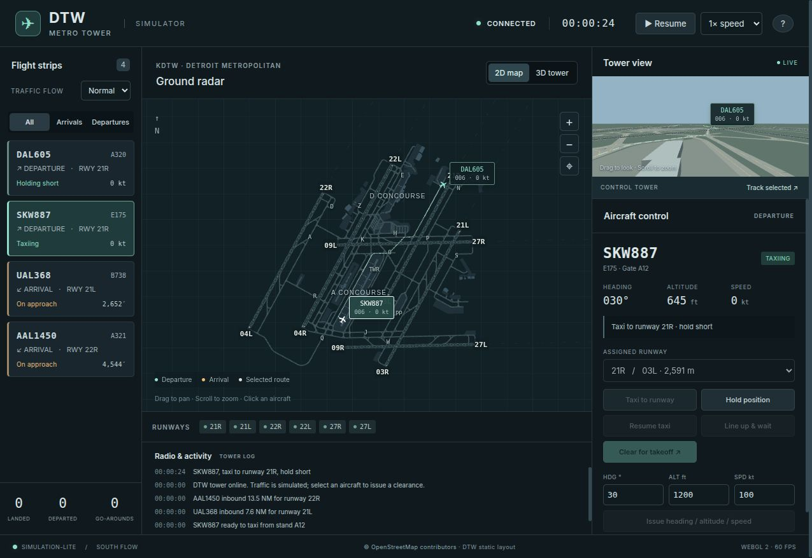

# DTW Metro Tower



A single-player air traffic control simulator written in Go, with synchronized
WebGL 2 ground radar and a 3D view from Detroit Metropolitan Airport's control
tower. Each player gets an independent game at the same URL. The simulation runs
in Go; the browser renders its live state and sends aircraft clearances.

## Run

Requires Go 1.24 or newer and a desktop browser with WebGL 2 enabled.

```sh
go run .
```

Open **http://127.0.0.1:8080**. The server binds to your computer's loopback
interface by default. No Node.js installation, package installation, API keys,
or external services are needed to run the simulator.

To build a portable executable with the UI and airport data embedded:

```sh
go build -buildvcs=false -trimpath -o bin/atc-sim .
./bin/atc-sim
```

For UI development, use `go run . -dev` to serve editable files from `web/`;
reload the browser after edits.

Use `-addr 127.0.0.1:8090` to change the listening address.

## Docker

With Docker Engine or Docker Desktop and the Compose plugin installed:

```sh
docker compose up --build -d
```

Open **http://127.0.0.1:8080**. Follow logs with `docker compose logs -f` and
stop the service with `docker compose down`.

Compose runs the app as a non-root user with a read-only filesystem. The image
includes the executable, UI, airport data, and license notices; it needs no
volumes. Games remain in memory and are lost when the container restarts.

These optional environment variables can also be set in a local `.env` file:

| Variable | Default | Purpose |
| --- | --- | --- |
| `ATC_BIND_ADDRESS` | `127.0.0.1` | Host interface to publish on |
| `ATC_PORT` | `8080` | Host port |
| `ATC_MAX_SESSIONS` | `256` | Maximum retained games |
| `ATC_SESSION_TIMEOUT` | `30m` | How long to retain a disconnected game |

For example, to let players on your local network connect on port 8090:

```sh
ATC_BIND_ADDRESS=0.0.0.0 ATC_PORT=8090 docker compose up --build -d
```

Share `http://<your-computer-ip>:8090`. For public internet hosting, use the
HTTPS reverse proxy setup described below.

To build and run without Compose:

```sh
docker build -t atc-sim:local .
docker run --rm -p 127.0.0.1:8080:8080 atc-sim:local
```

## Caddy under /atc/

The app works at `/` or behind a reverse proxy that strips a public prefix.
Assets, API calls, live updates, and game cookies follow the public path
automatically; no base-path flag or cookie rewriting is needed.

For Caddy running on the Docker host, publish the app on port 10111:

```sh
ATC_PORT=10111 docker compose up --build -d
```

Or run the Go server directly with `go run . -addr 127.0.0.1:10111`.
Add this block inside your Caddy site:

```caddyfile
handle /atc* {
	redir /atc /atc/ 301
	uri strip_prefix /atc
	reverse_proxy localhost:10111
}
```

Open `https://<your-domain>/atc/`. The redirect preserves the trailing slash
needed to resolve the page's relative assets. Separate app mounts on the same
domain keep their game cookies and browser-tab coordination separate.

Caddy's defaults preserve the public Host for same-origin checks and flush
Server-Sent Events immediately. Keep those defaults; extra `header_up`,
`header_down`, and `flush_interval` directives are unnecessary for this setup.
See [Caddy's reverse proxy documentation](https://caddyserver.com/docs/caddyfile/directives/reverse_proxy#streaming).
When Caddy terminates HTTPS, its `X-Forwarded-Proto` header enables Secure game
cookies. Keep the app's published port on loopback as in the Compose default.

If Caddy runs in a separate container, `localhost` refers to that container.
Place both services on the same Docker network and use `reverse_proxy atc-sim:8080`
instead; the `/atc/` handling stays the same.

## Independent games

Multiple players can open the same server URL and play independently. Aircraft,
clearances, pause, speed, traffic flow, resets, and statistics belong to each game.
No account or room code is needed.

- A browser cookie identifies your game. Refreshing the page resumes it, and
  tabs in the same browser profile share it and its live-update connection.
  Older browsers without SharedWorker support use a connection per tab; keep
  fewer than six tabs open on plain HTTP in those browsers. Use a different
  browser profile or a private window to try another independent game on one computer. Private
  windows may share cookies with other private windows in the same browser.
- A game stops advancing when its last connected tab disconnects. Reconnecting
  resumes it with its previous pause and speed settings. After 30 minutes with
  no connected tabs, the game expires and the next visit starts a new one.
- Games are kept in server memory. Restarting the server starts everyone over;
  open pages reconnect automatically. Cookies must be allowed for the site.
- The default limit is 256 games, including disconnected games awaiting expiry.
  If the server is full, new players wait and retry automatically; existing
  players can continue. Set `-max-sessions` and `-session-timeout` to adjust these
  limits, for example `go run . -max-sessions 100 -session-timeout 15m`.

To let other players connect over your local network:

```sh
go run . -addr 0.0.0.0:8080
```

Share `http://<your-computer-ip>:8080`. For public internet hosting, use an HTTPS
reverse proxy that passes cookies and streams `/api/events` without buffering.
The server has no sign-in requirement; anyone who can reach it can start a game.

## Play

- Click an aircraft or flight strip. A departure is already holding short when
  the session starts, so you can immediately issue a takeoff clearance.
- For a departure at a gate, select a runway and **Taxi to runway**. The aircraft
  follows the taxiway network and holds short. **Line up & wait** is optional;
  **Clear for takeoff** authorizes entering the runway and departing.
- For an arrival, issue **Clear to land** before short final (about 1 NM). Without
  clearance, it goes around. Landing aircraft vacate and taxi back to a stand.
- Use **Hold position** and **Resume taxi** to manage ground traffic. Runway
  reservations, occupancy, intersecting strips and nearby aircraft are checked.
  A taxiing departure can be rerouted by selecting another runway and issuing
  **Taxi to runway** again, including to resolve opposing ground traffic.
  Converging taxi routes yield to the nearer aircraft at a merge, with priority
  for aircraft vacating a reserved runway.
  For opposing arrivals, choose a different free **Destination stand** and issue
  **Taxi to stand** to reroute one aircraft away from the conflict. A stand
  clearance resumes a held aircraft; occupied or unreachable stands are rejected.
- Airborne aircraft accept heading, altitude and speed instructions. Heading
  uses degrees from true north; altitude is feet MSL; speed is knots. A landing
  clearance returns an aircraft to its assigned approach. Issuing a vector
  cancels any existing landing clearance; clear the aircraft to land again
  when ready. **Clear to land** also returns a vectored go-around to an approach
  fix for the selected runway.
- Drag and scroll on the ground map to pan and zoom. Drag the tower view to look
  around, scroll to change its field of view, or track the selected aircraft.
  The 2D/3D selector exchanges the main and secondary views.
- Adjust **Traffic flow** for light, normal or busy continuous traffic. Pause
  or accelerate time with the top controls. **Space** pauses; **Escape** clears
  selection. The help dialog contains **Reset session**.

## Implementation

- Standard-library Go HTTP server, embedded assets, fixed simulation steps with
  0.1-second physics substeps, and Server-Sent Events at 10 Hz.
- Go owns aircraft motion, ground routes, clearances, continuous traffic,
  runway reservations and activity history.
- Plain JavaScript ES modules and locally vendored Three.js 0.180.0. Static
  airport geometry is batched into GPU buffers; aircraft positions interpolate
  between server snapshots. Rendering pauses while the tab is hidden.
- No frontend build step or runtime CDN requests. The Three.js MIT license is
  included in `web/vendor/THREE-LICENSE.txt`.

```sh
go test -race ./...
go vet ./...
```

The shared-stream JavaScript tests use Node.js 18 or newer (only for testing):

```sh
node --test scripts/events-worker.test.cjs
```

## Airport fidelity

The static dataset contains all six physical runways, mapped taxiway and stand
paths, terminal footprints, aprons and selected real stand labels. It uses an
OpenStreetMap July 2026 snapshot, checked against the FAA September 2026 airport
diagram. Short modeled apron connectors join stand paths to the routing graph.
See [data/SOURCES.md](data/SOURCES.md) for sources, dates, licenses and the
reproducible importer.

This is simulation-lite: aircraft performance and procedures are simplified,
traffic and callsigns are synthetic, and wind is fixed to a southerly operation.
Terrain is flat, building heights are illustrative, and this first version
operates the south/west runway ends. It does not model live traffic, NOTAMs,
weather changes, wake categories, detailed phraseology, displaced thresholds,
or real-world gate availability. It is not an operational training tool.

## License

Original project source code is licensed under the [MIT License](LICENSE).

Airport geometry is © OpenStreetMap contributors, licensed under ODbL 1.0.
See [data/SOURCES.md](data/SOURCES.md) for data sources and attribution.

Vendored Three.js retains its own [MIT license](web/vendor/THREE-LICENSE.txt).
